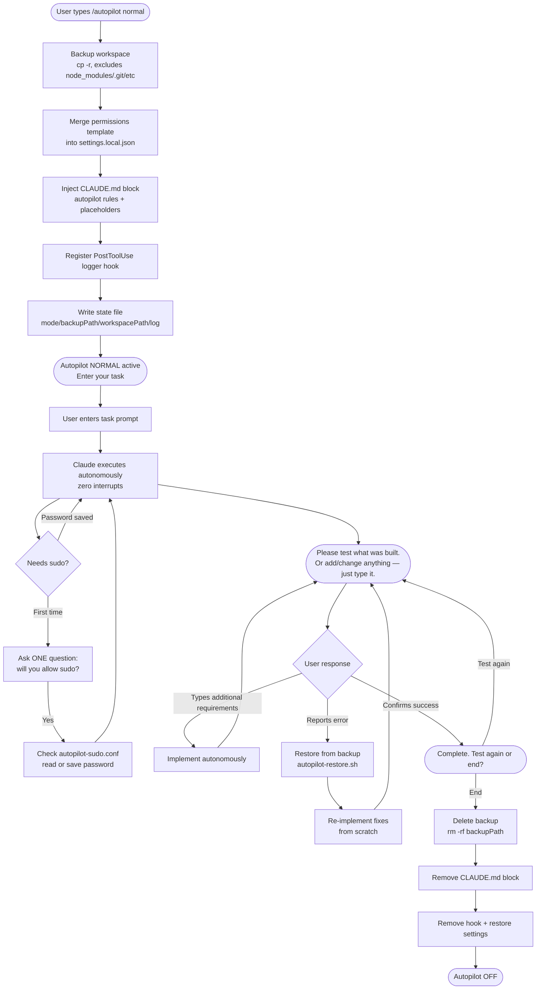
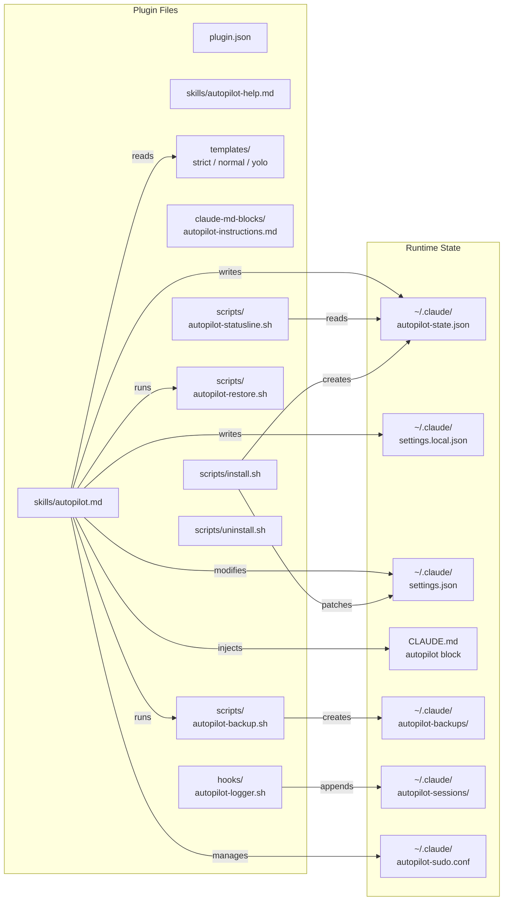

# Claude Code Autopilot

Claude Code Autopilot is a plugin that enables fully autonomous, zero-interrupt task execution inside Claude Code. You enter a prompt, Claude executes the entire task — file edits, shell commands, installs, git operations — without stopping to ask for confirmations. When done, it presents a test gate so you can verify results or request changes before the session closes.

  

---

## How It Works



For terminals that cannot render Mermaid:

```
/autopilot [mode]
      │
      ▼
 Backup workspace ──────────────────────────────────────────────┐
 (cp -r, excludes: node_modules/.git/__pycache__)               │
      │                                                          │
      ▼                                                          │
 Merge permissions ──► settings.local.json                       │
      │                                                          │
      ▼                                                          │
 Inject CLAUDE.md block (<!-- autopilot:start/end -->)           │
      │                                                          │
      ▼                                                          │
 Write state file (~/.claude/autopilot-state.json)              │
      │                                                     BACKUP
      ▼                                                     EXISTS
 USER ENTERS TASK                                                │
      │                                                          │
      ▼                                                          │
 Claude executes ──► zero interrupts ──► logs every tool call    │
      │                                                          │
      ▼                                                          │
 "Please test [X]. Add/change anything? Just type it."          │
      │                                                          │
      ├─► Error reported ──► restore from backup ◄──────────────┘
      │   auto-debug, re-implement
      │
      ├─► Additional requirements ──► implement autonomously ──► loop
      │
      └─► Success: "Complete. Test again or end?"
              │
              └─► "end" ──► Delete backup ──► /autopilot off
```

---

## Safety Levels

| Mode | Auto-approves | Still pauses for | Use case |
|------|--------------|-----------------|----------|
| `strict` | git, npm, node, python, basic file ops | `rm -rf`, force push, DROP TABLE, credential writes | Safe coding tasks |
| `normal` | Everything in strict + curl, apt, brew, systemctl, chmod, pip, npx, pnpm | Nothing (logs risky ops) | Most dev tasks |
| `yolo` | Everything (dangerouslySkipPermissions) | Nothing | Trusted automation, CI |

---

## Installation

### Method 1: Claude Code Plugin System (Recommended)

```bash
# Clone the repo
git clone https://github.com/[USERNAME]/autopilot-plugin ~/.claude/plugins/autopilot-plugin

# Install the plugin
claude plugin install ~/.claude/plugins/autopilot-plugin

# Run install script
bash ~/.claude/plugins/autopilot-plugin/scripts/install.sh
```

### Method 2: Manual

1. Clone repo to `~/.claude/plugins/autopilot-plugin/`
2. Run `bash scripts/install.sh` (patches `settings.json` statusLine)
3. Ensure scripts are executable: `chmod +x scripts/*.sh hooks/*.sh`
4. Restart Claude Code

### Post-Installation Check

```bash
# Verify scripts are executable
ls -la ~/.claude/plugins/autopilot-plugin/scripts/
ls -la ~/.claude/plugins/autopilot-plugin/hooks/

# Check state file was created
cat ~/.claude/autopilot-state.json
```

---

## Usage

### Quick Start

```
/autopilot normal
```

Then just type your task. That's it.

### All Commands

| Command | Description |
|---------|-------------|
| `/autopilot strict` | Safe mode — pauses before destructive ops |
| `/autopilot normal` | Broad auto-approval — most dev tasks |
| `/autopilot yolo` | Full bypass — trust everything |
| `/autopilot off` | Deactivate, delete backup, restore settings |
| `/autopilot status` | Show current mode, backup path, log path |
| `/autopilot-help` | Full reference card |

### The Test Gate

Before completing any task, Claude will say:

> "Please test [what was built / how to test it]. If you want to add or change anything before we wrap up, just type it — otherwise confirm test results."

- **Confirm success** → "Complete. Test again or end?"
- **Report an error** → Claude auto-restores from backup and re-fixes
- **Type more requirements** → Claude implements them, re-presents the gate

---

## Backup & Restore

### What Gets Backed Up

On `/autopilot [mode]`:

- Full workspace copied to `~/.claude/autopilot-backups/{timestamp}/`
- Excluded: `node_modules/`, `.git/`, `__pycache__/`, `.venv/`, `venv/`, `dist/`, `build/`, `.next/`, `.cache/`, `*.pyc`, `.DS_Store`
- Uses `rsync` (if available) or `cp -r` fallback

### Manual Restore

If you need to restore manually:

```bash
# Find your backup
ls ~/.claude/autopilot-backups/

# Restore
bash ~/.claude/plugins/autopilot-plugin/scripts/autopilot-restore.sh \
  ~/.claude/autopilot-backups/20260428-100000 \
  /path/to/your/project
```

### Backup Lifecycle

```
/autopilot on  → backup created
   task runs   → backup preserved throughout
  test passes  → backup preserved until user says "end"
   user: end   → backup deleted (/autopilot off)
   crash/kill  → backup survives (recoverable manually)
```

---

## Audit Log

Every tool call is logged when autopilot is active:

```
~/.claude/autopilot-sessions/{timestamp}.log
```

Example log:

```
[10:23:01] TOOL:Bash | mode:normal | input:git add -A
[10:23:02] TOOL:Bash | mode:normal | input:git commit -m "feat: add user a
[10:23:04] TOOL:Edit | mode:normal | input:{"file_path":"/home/user/proj/s
[10:23:05] TOOL:Write | mode:normal | input:{"file_path":"/home/user/proj/
```

View live log:

```bash
tail -f $(cat ~/.claude/autopilot-state.json | python3 -c "import json,sys,os; d=json.load(sys.stdin); print(os.path.expanduser(d['sessionLog']))")
```

---

## Sudo Password Persistence

When autopilot first needs `sudo`, it asks one question:

> "If I require sudo permissions or a password, will you allow me to execute?"

If you allow it, the password is saved to `~/.claude/autopilot-sudo.conf` (chmod 600) for future sessions — you will never be asked again.

> **Security warning:** The password is stored in plaintext. `chmod 600` provides user-level protection only. Do not use this feature on shared or multi-user machines.

To clear the saved password:

```bash
rm ~/.claude/autopilot-sudo.conf
```

---

## Status Bar

When autopilot is active, your Claude Code status bar shows:

```
[AP:NORMAL]   [AP:STRICT]   [AP:YOLO]
```

Nothing is shown when autopilot is off.

---

## Architecture Diagram



---

## Uninstalling

```bash
bash ~/.claude/plugins/autopilot-plugin/scripts/uninstall.sh
```

The uninstall script:

- Warns if autopilot is active (preserves backup)
- Asks before deleting saved sudo password
- Removes statusLine patch
- Removes autopilot-logger hook
- Does NOT delete session logs or backups (manual cleanup)

To fully clean up:

```bash
rm -rf ~/.claude/autopilot-backups/
rm -rf ~/.claude/autopilot-sessions/
rm -f ~/.claude/autopilot-state.json
rm -f ~/.claude/autopilot-sudo.conf
```

---

## File Reference

| File | Purpose |
|------|---------|
| `plugin.json` | Plugin manifest |
| `skills/autopilot.md` | `/autopilot` command logic |
| `skills/autopilot-help.md` | `/autopilot-help` reference |
| `templates/strict.json` | Strict mode permission delta |
| `templates/normal.json` | Normal mode permission delta |
| `templates/yolo.json` | Yolo mode (bypass all permissions) |
| `claude-md-blocks/autopilot-instructions.md` | CLAUDE.md injection template |
| `hooks/autopilot-logger.sh` | PostToolUse audit logger |
| `scripts/autopilot-backup.sh` | Workspace backup (cp -r) |
| `scripts/autopilot-restore.sh` | Workspace restore (cp -r) |
| `scripts/autopilot-statusline.sh` | Status bar [AP:MODE] component |
| `scripts/install.sh` | Plugin installation |
| `scripts/uninstall.sh` | Plugin removal |

---

## License

MIT
