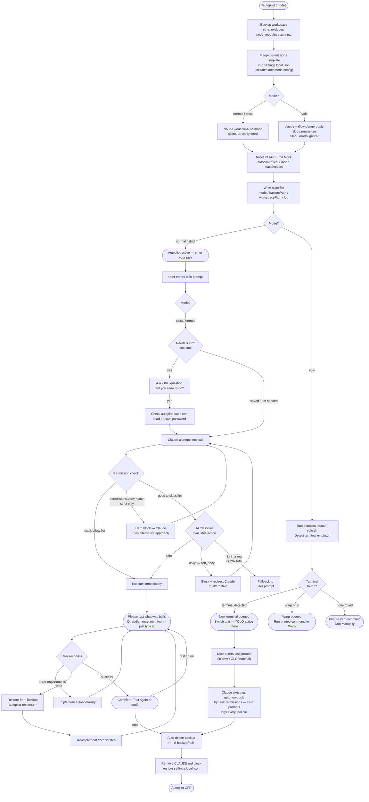
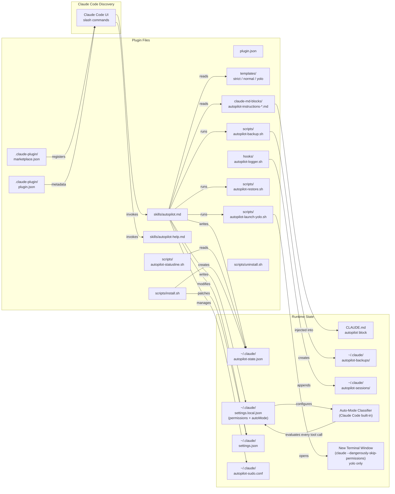

# Claude Code Autopilot

Claude Code Autopilot is a plugin that enables fully autonomous, zero-interrupt task execution inside Claude Code. You enter a prompt, Claude executes the entire task — file edits, shell commands, installs, git operations — without stopping to ask for confirmations. In `normal`/`strict` mode a test gate lets you verify results before closing. In `yolo` mode, activation automatically opens a **new terminal window** running `claude --dangerously-skip-permissions` — switch to it and enter your task. Zero human interaction from start to finish.

  

```bash
claude plugin marketplace add devjyoti786/autopilot-plugin && claude plugin install autopilot@autopilot-plugin
```

---

## How It Works



For terminals that cannot render Mermaid:

```
/autopilot [mode]
      │
      ▼
 Backup workspace ──────────────────────────────────────────────┐
 (cp -r, excludes: node_modules/.git/__pycache__)               │
      │                                                          │
      ▼                                                          │
 Merge permissions ──► settings.local.json                       │
      │                                                          │
      ▼                                                          │
 Unlock mode prerequisite (silent)                               │
 ├── normal/strict: claude --enable-auto-mode -p ""              │
 └── yolo:          claude --allow-dangerously-skip-permissions   │
      │                                                          │
      ▼                                                          │
 Inject CLAUDE.md block (<!-- autopilot:start/end -->)           │
      │                                                          │
      ▼                                                          │
 Write state file (~/.claude/autopilot-state.json)              │
      │                                                     BACKUP
      ▼                                                     EXISTS
 ┌────────────────────────────────────────────────────┐         │
 │ Mode branch                                        │         │
 ├── normal/strict ──► "Autopilot active — enter task"│         │
 │                                                    │         │
 └── yolo ──► autopilot-launch-yolo.sh                │         │
              Detect terminal emulator                │         │
              ├─► found  ──► NEW TERMINAL OPENS       │         │
              │             (claude --dangerously-     │         │
              │              skip-permissions)         │         │
              ├─► warp   ──► Warp opens, print cmd    │         │
              └─► none   ──► Print restart command    │         │
 └────────────────────────────────────────────────────┘         │
      │                                                          │
      ▼  (normal/strict path continues; yolo: in new terminal)  │
 USER ENTERS TASK                                                │
      │                                                          │
      ▼                                                          │
 Claude executes ──► zero interrupts ──► logs every tool call    │
      │                                                          │
      ├─── strict/normal ──────────────────────────────────────  │
      │         │                                                │
      │         ▼                                                │
      │    Permission check                                      │
      │    ├─► static allow list ──► execute immediately         │
      │    ├─► permissions.deny (strict) ──► hard block          │
      │    └─► AI Classifier ──► safe/soft_deny/fallback         │
      │         │                                                │
      │         ▼                                                │
      │    [sudo needed? ask once → save to autopilot-sudo.conf] │
      │         │                                                │
      │         ▼                                                │
      │    "Please test [X]. Add/change anything? Just type it." │
      │         │                                                │
      │         ├─► Error ──► restore from backup ◄─────────────┘
      │         │    auto-debug, re-implement
      │         │
      │         ├─► Additional requirements ──► implement ──► loop
      │         │
      │         └─► Success: "Complete. Test again or end?"
      │                  └─► "end" ──► Delete backup ──► off
      │
      └─── yolo (in new terminal, bypassPermissions active) ─────
                │
                ▼
           [no sudo consent, no test gate, no end confirmation]
           [all tool calls execute immediately — no classifier]
                │
                ▼
           Auto-delete backup ──► /autopilot off
```

---

## Safety Levels

| Mode | Static allow list | Hard deny (`permissions.deny`) | Classifier (`autoMode`) | Auto-unlock on activate | Human interaction |
|------|-------------------|-------------------------------|-------------------------|-------------------------|-------------------|
| `strict` | git, npm, node, python, basic file ops | `rm -rf`, force push (never bypassed) | Default blocks + extra: DROP TABLE, plaintext credential writes | `claude --enable-auto-mode` | Sudo consent (once) + test gate + end confirmation |
| `normal` | Everything in strict + curl, apt, brew, systemctl, chmod, pip, npx, pnpm | none | Default blocks + extra allow: package installs when user-requested | `claude --enable-auto-mode` | Sudo consent (once) + test gate + end confirmation |
| `yolo` | Everything (`bypassPermissions`) | none | **No classifier** — all tool calls execute immediately | Opens new terminal with `claude --dangerously-skip-permissions` | **None** — fully autonomous start to finish. New terminal opens automatically on activation. |

---

## Auto-Mode Classifier

Auto mode is Claude Code's built-in AI permission layer. Instead of asking you to approve every tool call, it evaluates each action before it runs and decides automatically.

### Decision flow (normal / strict)

```
Tool call attempted
        │
        ▼
1. Static allow/deny (permissions.allow / permissions.deny in settings.local.json)
   → allow match: execute immediately
   → deny match: hard block, Claude tries alternative  [strict only]
        │ no match
        ▼
2. Read-only + working-directory file edits → auto-approved
        │ everything else
        ▼
3. AI Classifier reads: action + full transcript + autoMode config
   → soft_deny match: block, Claude redirected to try differently
   → allow exception match: override block, execute
   → explicit user intent ("force-push this branch"): override soft_deny
        │ blocked 3× in a row OR 20× total
        ▼
4. Fallback to user prompt (auto mode pauses)
```

### Per-mode configuration

**Strict mode** — `templates/strict.json`
- Auto-unlock: `claude --enable-auto-mode` runs silently at activation
- `permissions.deny` hard-blocks: `rm -rf *`, `git push --force*`, `git push -f *`
- `autoMode.soft_deny` extras: DROP TABLE/DATABASE, plaintext credential writes to tracked files
- `autoMode.environment`: declares strict/cautious dev profile to classifier

**Normal mode** — `templates/normal.json`
- Auto-unlock: `claude --enable-auto-mode` runs silently at activation
- No hard denies
- `autoMode.allow` extras: package installs via apt/brew/pip/npm/pnpm/npx when user-requested
- `autoMode.environment`: declares broad dev environment profile

**Yolo mode** — `templates/yolo.json`
- Auto-unlock: `claude --allow-dangerously-skip-permissions` runs silently at activation
- `bypassPermissions`: classifier does not run, all tool calls execute immediately

### Inspect classifier rules

```bash
# See what the classifier uses in your current session
claude auto-mode config

# See built-in defaults (allow + soft_deny lists)
claude auto-mode defaults

# Get AI critique of your custom rules
claude auto-mode critique
```

> Auto mode requires a Claude Pro, Team, Enterprise, Max, or API plan. The plugin automatically runs `claude --enable-auto-mode` when activating normal or strict mode — no manual setup needed.

---

## Installation

### Method 1: One-line install (Recommended)

```bash
claude plugin marketplace add devjyoti786/autopilot-plugin && claude plugin install autopilot@autopilot-plugin
```

Then run the setup script once:

```bash
bash ~/.claude/plugins/cache/autopilot-plugin/autopilot/*/scripts/install.sh
```

### Method 2: Clone and install manually

```bash
git clone https://github.com/devjyoti786/autopilot-plugin ~/.claude/plugins/autopilot-plugin
claude plugin install ~/.claude/plugins/autopilot-plugin
bash ~/.claude/plugins/autopilot-plugin/scripts/install.sh
```

### Method 3: Manual (no plugin system)

1. Clone repo to `~/.claude/plugins/autopilot-plugin/`
2. Run `bash scripts/install.sh` (patches `settings.json` statusLine)
3. Ensure scripts are executable: `chmod +x scripts/*.sh hooks/*.sh`
4. Restart Claude Code

### Post-Installation Check

```bash
# Verify scripts are executable
ls -la ~/.claude/plugins/autopilot-plugin/scripts/
ls -la ~/.claude/plugins/autopilot-plugin/hooks/

# Check state file was created
cat ~/.claude/autopilot-state.json
```

---

## Usage

### Quick Start

```
/autopilot normal
```

Then just type your task. That's it.

### All Commands

| Command | Description |
|---------|-------------|
| `/autopilot strict` | Safe mode — pauses before destructive ops |
| `/autopilot normal` | Broad auto-approval — most dev tasks |
| `/autopilot yolo` | Full bypass — trust everything. Opens new terminal with `--dangerously-skip-permissions` automatically. |
| `/autopilot off` | Deactivate, delete backup, restore settings |
| `/autopilot status` | Show current mode, backup path, log path |
| `/autopilot-help` | Full reference card |

### The Test Gate (strict / normal only)

Before completing any task, Claude will say:

> "Please test [what was built / how to test it]. If you want to add or change anything before we wrap up, just type it — otherwise confirm test results."

- **Confirm success** → "Complete. Test again or end?"
- **Report an error** → Claude auto-restores from backup and re-fixes
- **Type more requirements** → Claude implements them, re-presents the gate

> **Yolo mode skips the test gate entirely.** Claude declares complete, auto-deletes the backup, and runs `/autopilot off` — no user input needed.

---

## Backup & Restore

### What Gets Backed Up

On `/autopilot [mode]`:

- Full workspace copied to `~/.claude/autopilot-backups/{timestamp}/`
- Excluded: `node_modules/`, `.git/`, `__pycache__/`, `.venv/`, `venv/`, `dist/`, `build/`, `.next/`, `.cache/`, `*.pyc`, `.DS_Store`
- Uses `rsync` (if available) or `cp -r` fallback

### Manual Restore

If you need to restore manually:

```bash
# Find your backup
ls ~/.claude/autopilot-backups/

# Restore
bash ~/.claude/plugins/autopilot-plugin/scripts/autopilot-restore.sh \
  ~/.claude/autopilot-backups/20260428-100000 \
  /path/to/your/project
```

### Backup Lifecycle

```
/autopilot on       → backup created (all modes)
   task runs        → backup preserved throughout
   [strict/normal]  → backup preserved until user says "end"
   user: end        → backup deleted (/autopilot off)
   [yolo]           → backup auto-deleted on task completion
   crash/kill       → backup survives (recoverable manually)
```

---

## Audit Log

Every tool call is logged when autopilot is active:

```
~/.claude/autopilot-sessions/{timestamp}.log
```

Example log:

```
[10:23:01] TOOL:Bash | mode:normal | input:git add -A
[10:23:02] TOOL:Bash | mode:normal | input:git commit -m "feat: add user a
[10:23:04] TOOL:Edit | mode:normal | input:{"file_path":"/home/user/proj/s
[10:23:05] TOOL:Write | mode:normal | input:{"file_path":"/home/user/proj/
```

View live log:

```bash
tail -f $(cat ~/.claude/autopilot-state.json | python3 -c "import json,sys,os; d=json.load(sys.stdin); print(os.path.expanduser(d['sessionLog']))")
```

---

## Sudo Password Persistence

**strict / normal mode:** When autopilot first needs `sudo`, it asks one question:

> "If I require sudo permissions or a password, will you allow me to execute?"

If you allow it, the password is saved to `~/.claude/autopilot-sudo.conf` (chmod 600) for future sessions — you will never be asked again.

**yolo mode:** The consent question is skipped entirely. `bypassPermissions` is active, so sudo commands run directly without prompting.

> **Security warning:** The password is stored in plaintext. `chmod 600` provides user-level protection only. Do not use this feature on shared or multi-user machines.

To clear the saved password:

```bash
rm ~/.claude/autopilot-sudo.conf
```

---

## Status Bar

When autopilot is active, your Claude Code status bar shows:

```
[AP:NORMAL]   [AP:STRICT]   [AP:YOLO]
```

Nothing is shown when autopilot is off.

---

## Architecture Diagram



---

## Uninstalling

```bash
bash ~/.claude/plugins/autopilot-plugin/scripts/uninstall.sh
```

The uninstall script:

- Warns if autopilot is active (preserves backup)
- Asks before deleting saved sudo password
- Removes statusLine patch
- Removes autopilot-logger hook
- Does NOT delete session logs or backups (manual cleanup)

To fully clean up:

```bash
rm -rf ~/.claude/autopilot-backups/
rm -rf ~/.claude/autopilot-sessions/
rm -f ~/.claude/autopilot-state.json
rm -f ~/.claude/autopilot-sudo.conf
```

---

## File Reference

| File | Purpose |
|------|---------|
| `plugin.json` | Plugin manifest |
| `.claude-plugin/marketplace.json` | Local marketplace registration |
| `.claude-plugin/plugin.json` | Plugin metadata for marketplace |
| `skills/autopilot.md` | `/autopilot` command logic |
| `skills/autopilot/SKILL.md` | Symlink for Claude Code skill discovery |
| `skills/autopilot-help.md` | `/autopilot-help` reference |
| `skills/autopilot-help/SKILL.md` | Symlink for Claude Code skill discovery |
| `templates/strict.json` | Strict mode permission delta |
| `templates/normal.json` | Normal mode permission delta |
| `templates/yolo.json` | Yolo mode (`bypassPermissions`) |
| `claude-md-blocks/autopilot-instructions.md` | CLAUDE.md injection template (mode-conditional rules) |
| `hooks/autopilot-logger.sh` | PostToolUse audit logger |
| `scripts/autopilot-backup.sh` | Workspace backup (cp -r) |
| `scripts/autopilot-restore.sh` | Workspace restore (cp -r) |
| `scripts/autopilot-launch-yolo.sh` | YOLO: open new terminal with `--dangerously-skip-permissions` |
| `scripts/autopilot-statusline.sh` | Status bar [AP:MODE] component |
| `scripts/install.sh` | Plugin installation |
| `scripts/uninstall.sh` | Plugin removal |

---

## License

MIT
