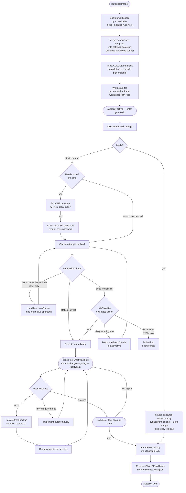
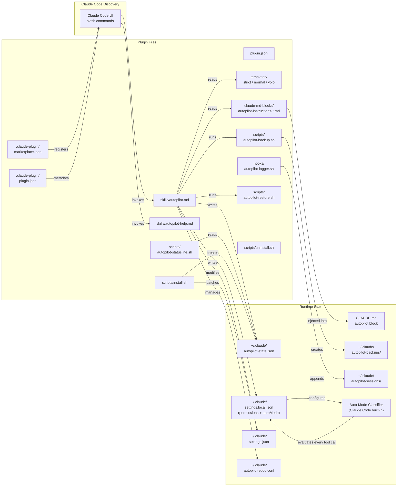

# Auto-Mode Classifier Integration Implementation Plan

> **For agentic workers:** REQUIRED SUB-SKILL: Use superpowers:subagent-driven-development (recommended) or superpowers:executing-plans to implement this plan task-by-task. Steps use checkbox (`- [ ]`) syntax for tracking.

**Goal:** Add per-mode auto-mode classifier configuration to strict/normal templates and update README with classifier flow diagrams and documentation.

**Architecture:** Templates (`strict.json`, `normal.json`) gain an `autoMode` block that is merged into `settings.local.json` at activation, giving the classifier per-mode context. Strict mode also gains `permissions.deny` hard-blocks for `rm -rf` and force-push, replacing the behavioral HALT rule in its CLAUDE.md block.

**Tech Stack:** JSON (templates), Markdown (README, claude-md-blocks), Mermaid (diagrams), git + gh CLI (publishing)

---

## File Map

| File | Change |
|------|--------|
| `templates/strict.json` | Add `permissions.deny` + `autoMode` block |
| `templates/normal.json` | Add `autoMode` block |
| `claude-md-blocks/autopilot-instructions-strict.md` | Remove rule 10 |
| `README.md` | Update flowchart, safety table, add classifier section, update arch diagram |
| `docs/superpowers/specs/2026-04-29-auto-mode-integration-design.md` | Already written — commit alongside plan |

---

## Task 1: Add `permissions.deny` + `autoMode` to `strict.json`

**Files:**
- Modify: `templates/strict.json`

- [ ] **Step 1: Replace contents of `templates/strict.json`**

The full new file:

```json
{
  "permissions": {
    "allow": [
      "Bash(git *)", "Bash(npm *)", "Bash(node *)", "Bash(python3 *)",
      "Bash(uv *)", "Bash(ls *)", "Bash(find *)", "Bash(mkdir *)",
      "Bash(cat *)", "Bash(echo *)", "Bash(grep *)", "Bash(sed *)",
      "Bash(cp *)", "Bash(touch *)", "Bash(which *)",
      "Read(**)", "Edit(**)", "Write(**)", "mcp__*"
    ],
    "deny": [
      "Bash(rm -rf *)", "Bash(rm -Rf *)", "Bash(rm -rf*)",
      "Bash(git push --force*)", "Bash(git push -f *)", "Bash(git push -f*)"
    ],
    "defaultMode": "auto"
  },
  "autoMode": {
    "environment": [
      "$defaults",
      "Claude Code autopilot strict mode. Treat this as a development environment requiring caution. Destructive local operations and force pushes are hard-blocked at the permissions layer. Flag anything that modifies files outside the working directory or interacts with production systems."
    ],
    "soft_deny": [
      "$defaults",
      "DROP TABLE or DROP DATABASE statements executed against any database without explicit session-level user instruction naming the exact table or database",
      "Writing plaintext passwords, API keys, or secrets to tracked files (files that would be committed to git)"
    ]
  }
}
```

- [ ] **Step 2: Verify JSON is valid**

```bash
python3 -c "import json; json.load(open('/home/hp/autopilot-plugin/templates/strict.json')); print('valid')"
```

Expected output: `valid`

- [ ] **Step 3: Commit**

```bash
cd /home/hp/autopilot-plugin && git add templates/strict.json
git commit -m "feat(strict): add permissions.deny hard-blocks + autoMode classifier config"
```

---

## Task 2: Add `autoMode` to `normal.json`

**Files:**
- Modify: `templates/normal.json`

- [ ] **Step 1: Replace contents of `templates/normal.json`**

```json
{
  "permissions": {
    "allow": [
      "Bash(git *)", "Bash(npm *)", "Bash(node *)", "Bash(python3 *)",
      "Bash(uv *)", "Bash(ls *)", "Bash(find *)", "Bash(mkdir *)",
      "Bash(cat *)", "Bash(echo *)", "Bash(grep *)", "Bash(sed *)",
      "Bash(cp *)", "Bash(touch *)", "Bash(which *)",
      "Bash(curl *)", "Bash(pip *)", "Bash(pip3 *)", "Bash(brew *)",
      "Bash(apt *)", "Bash(apt-get *)", "Bash(systemctl *)", "Bash(chmod *)",
      "Bash(mv *)", "Bash(tar *)", "Bash(unzip *)",
      "Bash(env *)", "Bash(npx *)", "Bash(pnpm *)",
      "Read(**)", "Edit(**)", "Write(**)", "mcp__*"
    ],
    "defaultMode": "auto"
  },
  "autoMode": {
    "environment": [
      "$defaults",
      "Claude Code autopilot normal mode. Local development environment. Broad tool access granted for routine dev tasks including package management, file operations, and build tooling."
    ],
    "allow": [
      "$defaults",
      "Installing packages via apt, apt-get, brew, pip, pip3, npm, npx, or pnpm when the agent is adding functionality or dependencies explicitly requested by the user in this session"
    ]
  }
}
```

- [ ] **Step 2: Verify JSON is valid**

```bash
python3 -c "import json; json.load(open('/home/hp/autopilot-plugin/templates/normal.json')); print('valid')"
```

Expected output: `valid`

- [ ] **Step 3: Commit**

```bash
cd /home/hp/autopilot-plugin && git add templates/normal.json
git commit -m "feat(normal): add autoMode classifier context + package install allow exception"
```

---

## Task 3: Remove rule 10 from strict CLAUDE.md block

**Files:**
- Modify: `claude-md-blocks/autopilot-instructions-strict.md`

Rule 10 currently reads:
> `10. HALT before executing any of: rm -rf, force push (git push --force), DROP TABLE, writing credentials or secrets to files. Notify user and wait for explicit approval before proceeding.`

This is now enforced at the tool level by `permissions.deny` (rm -rf, force push) and `autoMode.soft_deny` (DROP TABLE, credential writes). The behavioral instruction is redundant.

- [ ] **Step 1: Remove rule 10 from `claude-md-blocks/autopilot-instructions-strict.md`**

The file currently ends with rules 9 and 10 inside the `<!-- autopilot:end -->` block. Remove rule 10 entirely. Final file should be:

```markdown
<!-- autopilot:start -->
## AUTOPILOT MODE ACTIVE: STRICT

Rules (override all other defaults):
1. Never ask clarifying questions mid-task. Make best-effort judgment, note assumptions inline, continue.
2. Never wait for plan approval. Execute directly.
3. Auto-select tools, MCPs, skills, hooks as needed. Only invoke what is required; skip unnecessary calls.
4. Before declaring task complete: say "Please test [what was built / how to test it]. If you want to add or change anything before we wrap up, just type it — otherwise confirm test results." Wait for response. If user types additional requirements: implement them autonomously, then re-present the test gate.
5. If user reports an error: debug and fix autonomously without asking questions. Then say "Fixed. Please test again."
6. After user confirms success: say "Complete. Test again or end?" — wait for response.
7. Sudo rule: Before the FIRST sudo-required command in a session, ask exactly ONE question: "If I require sudo permissions or a password, will you allow me to execute?" If yes: check `~/.claude/autopilot-sudo.conf`. If exists: run `echo "$(cat ~/.claude/autopilot-sudo.conf)" | sudo -S cmd` — no prompt. If not: ask for password once, save with `printf 'PASSWORD' > ~/.claude/autopilot-sudo.conf && chmod 600 ~/.claude/autopilot-sudo.conf`, then use same pattern. NEVER run bare `sudo cmd` — always pipe via `-S`. If npm/npx/pnpm install fails, retry with `echo "$(cat ~/.claude/autopilot-sudo.conf)" | sudo -S npm install`. Never ask again after first time.
8. Backup at {BACKUP_PATH} (cp -r only, never mv). If test fails and restore needed: run autopilot-restore.sh (cp -r only, never mv), then re-apply fixes from scratch.
9. On user confirming "end": delete {BACKUP_PATH} with rm -rf, then deactivate autopilot (run /autopilot off).

> **Security note:** The sudo password is stored in plaintext at ~/.claude/autopilot-sudo.conf (chmod 600, user-read-only). Do not use this feature on shared machines.
<!-- autopilot:end -->
```

- [ ] **Step 2: Verify rule 10 is gone**

```bash
grep -n "HALT\|DROP TABLE\|force push\|rule 10" /home/hp/autopilot-plugin/claude-md-blocks/autopilot-instructions-strict.md
```

Expected output: *(no output — grep returns nothing)*

- [ ] **Step 3: Commit**

```bash
cd /home/hp/autopilot-plugin && git add claude-md-blocks/autopilot-instructions-strict.md
git commit -m "feat(strict): remove behavioral HALT rule — enforced at tool level via permissions.deny"
```

---

## Task 4: Update README — How It Works flowchart

**Files:**
- Modify: `README.md` (Mermaid flowchart section, lines ~11–44)

The current flowchart goes straight from "Merge permissions template" to "Autopilot active". Add the classifier decision step inside the task execution path.

- [ ] **Step 1: Replace the Mermaid flowchart in README.md**

Find the block between ` ```mermaid ` and the closing ` ``` ` (first mermaid block, ~lines 11–44) and replace with:



- [ ] **Step 2: Verify Mermaid block renders (visual check or syntax check)**

```bash
grep -c "flowchart TD" /home/hp/autopilot-plugin/README.md
```

Expected output: `1` (still one flowchart)

---

## Task 5: Update README — Safety Levels table + add Classifier section

**Files:**
- Modify: `README.md` (Safety Levels table ~lines 98–103, then insert new section after)

- [ ] **Step 1: Replace the Safety Levels table**

Find the table under `## Safety Levels` and replace with:

```markdown
## Safety Levels

| Mode | Static allow list | Hard deny (`permissions.deny`) | Classifier (`autoMode`) | Human interaction |
|------|-------------------|-------------------------------|-------------------------|-------------------|
| `strict` | git, npm, node, python, basic file ops | `rm -rf`, force push (never bypassed) | Default blocks + extra: DROP TABLE, plaintext credential writes | Sudo consent (once) + test gate + end confirmation |
| `normal` | Everything in strict + curl, apt, brew, systemctl, chmod, pip, npx, pnpm | none | Default blocks + extra allow: package installs when user-requested | Sudo consent (once) + test gate + end confirmation |
| `yolo` | Everything (`bypassPermissions`) | none | **No classifier** — all tool calls execute immediately | **None** — fully autonomous start to finish |
```

- [ ] **Step 2: Insert Auto-Mode Classifier section after Safety Levels**

Insert the following block immediately after the Safety Levels table (before the `---` separator):

```markdown

---

## Auto-Mode Classifier

Auto mode is Claude Code's built-in AI permission layer. Instead of asking you to approve every tool call, it evaluates each action before it runs and decides automatically.

### Decision flow (normal / strict)

```
Tool call attempted
        │
        ▼
1. Static allow/deny (permissions.allow / permissions.deny in settings.local.json)
   → allow match: execute immediately
   → deny match: hard block, Claude tries alternative [strict only]
        │ no match
        ▼
2. Read-only + working-directory file edits → auto-approved
        │ everything else
        ▼
3. AI Classifier reads: action + full transcript + autoMode config
   → soft_deny match: block, Claude redirected to try differently
   → allow exception match: override block, execute
   → explicit user intent ("force-push this branch"): override soft_deny
        │ blocked 3× in a row OR 20× total
        ▼
4. Fallback to user prompt (auto mode pauses)
```

### Per-mode configuration

**Strict mode** — `templates/strict.json`
- `permissions.deny` hard-blocks: `rm -rf *`, `git push --force*`, `git push -f *`
- `autoMode.soft_deny` extras: DROP TABLE/DATABASE, plaintext credential writes to tracked files
- `autoMode.environment`: declares strict/cautious dev profile to classifier

**Normal mode** — `templates/normal.json`
- No hard denies
- `autoMode.allow` extras: package installs via apt/brew/pip/npm/pnpm/npx when user-requested
- `autoMode.environment`: declares broad dev environment profile

**Yolo mode** — `templates/yolo.json`
- `bypassPermissions`: classifier does not run, all tool calls execute immediately

### Inspect classifier rules

```bash
# See what the classifier uses in your current session
claude auto-mode config

# See built-in defaults (allow + soft_deny lists)
claude auto-mode defaults

# Get AI critique of your custom rules
claude auto-mode critique
```

> Auto mode requires a Claude Team, Enterprise, Max, or API plan. Not available on Pro. Run `claude --enable-auto-mode` to enable it if you haven't already.
```

- [ ] **Step 3: Verify section inserted**

```bash
grep -n "Auto-Mode Classifier\|Decision flow\|Per-mode configuration" /home/hp/autopilot-plugin/README.md
```

Expected output: 3 matching lines with line numbers.

- [ ] **Step 4: Commit README changes so far**

```bash
cd /home/hp/autopilot-plugin && git add README.md
git commit -m "docs: update Safety Levels table + add Auto-Mode Classifier section to README"
```

---

## Task 6: Update README — Architecture Diagram

**Files:**
- Modify: `README.md` (Architecture Diagram mermaid block, ~lines 273–323)

- [ ] **Step 1: Replace the Architecture Diagram mermaid block**

Find the block under `## Architecture Diagram` and replace the mermaid content with:



- [ ] **Step 2: Verify second mermaid block present**

```bash
grep -c "graph LR" /home/hp/autopilot-plugin/README.md
```

Expected output: `1`

- [ ] **Step 3: Final commit for README arch diagram + commit spec and plan**

```bash
cd /home/hp/autopilot-plugin && git add README.md docs/
git commit -m "docs: update arch diagram with autoMode classifier node + add spec and plan"
```

---

## Task 7: Push to GitHub

- [ ] **Step 1: Verify all changes committed**

```bash
cd /home/hp/autopilot-plugin && git status
```

Expected output: `nothing to commit, working tree clean`

- [ ] **Step 2: Push to remote**

```bash
cd /home/hp/autopilot-plugin && git push origin main
```

Expected output: branch pushed, no errors.

- [ ] **Step 3: Verify on GitHub**

```bash
gh repo view devjyoti786/autopilot-plugin --web
```

Or check: `https://github.com/devjyoti786/autopilot-plugin`

---

## Self-Review

**Spec coverage check:**
- ✅ `strict.json`: `permissions.deny` for rm -rf and force push → Task 1
- ✅ `strict.json`: `autoMode` block with soft_deny extras → Task 1
- ✅ `normal.json`: `autoMode` block with allow exception → Task 2
- ✅ `autopilot-instructions-strict.md`: rule 10 removed → Task 3
- ✅ README flowchart updated with classifier step → Task 4
- ✅ README Safety Levels table updated → Task 5
- ✅ README Auto-Mode Classifier section added → Task 5
- ✅ README Architecture Diagram updated → Task 6
- ✅ Push to GitHub → Task 7

**Placeholder scan:** No TBD/TODO present.

**Type consistency:** JSON keys consistent across tasks (`autoMode.soft_deny`, `autoMode.allow`, `autoMode.environment`, `permissions.deny`). Mermaid node names don't cross-reference between diagrams.
